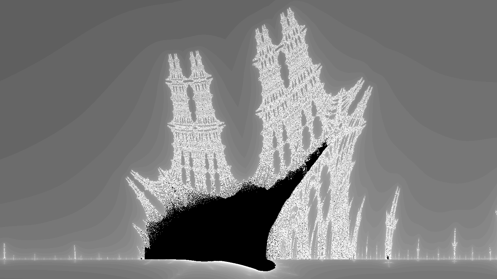
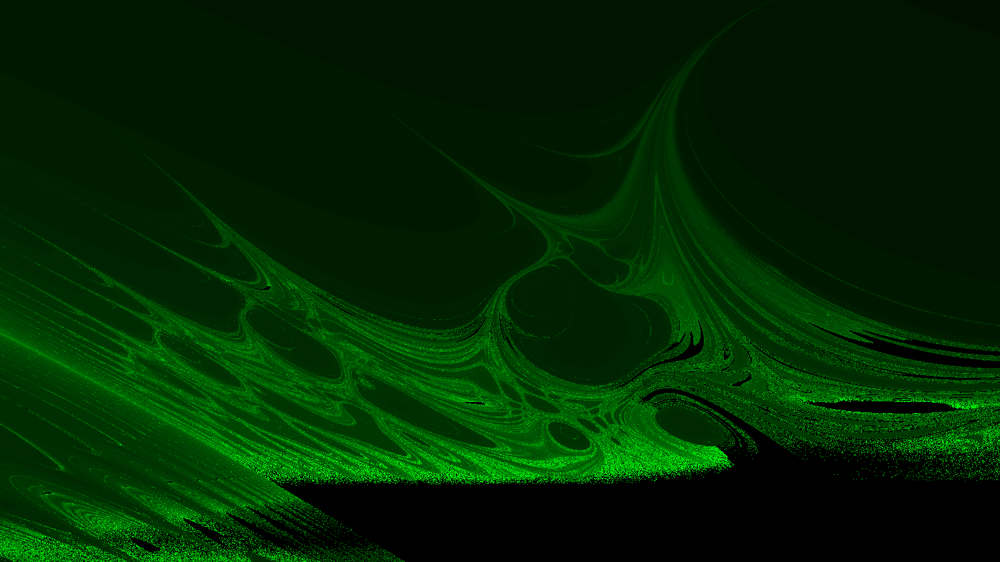
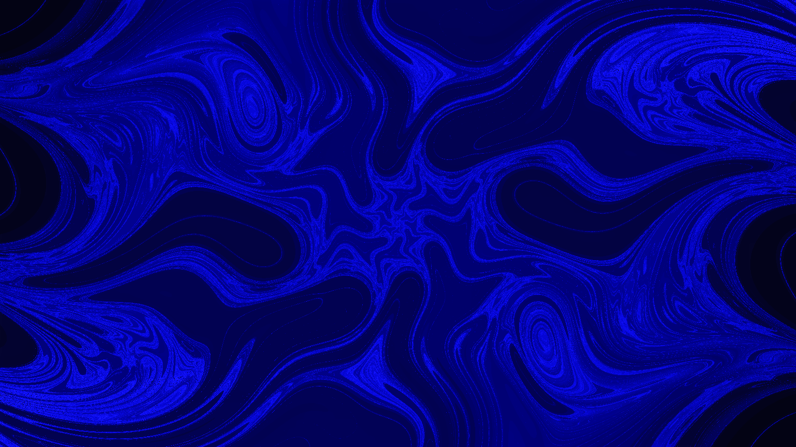
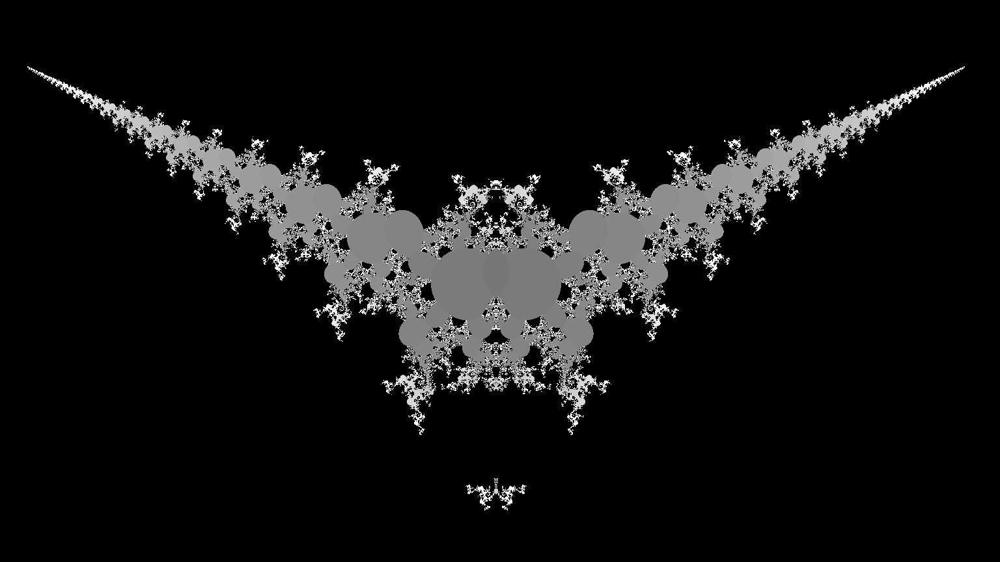
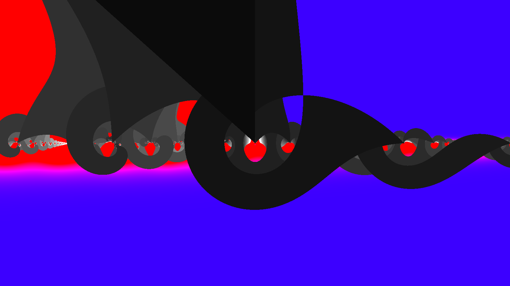
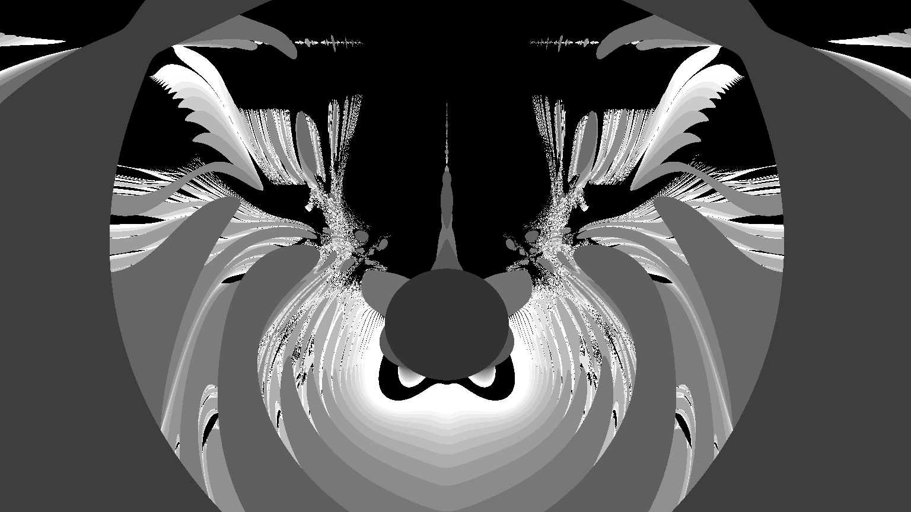

# fractals
 An adaptable, iterative fractal generator!

This program uses the classic fractal generation method for objects like the Mandelbrot set, where an iterative complex-valued function is analyzed for end behavior while varying a constant complex value c. The Mandelbrot example uses the function

f(z) = z^2 + c

where the output f(z) is used as the input z for the next iteration. For different values of c in the complex plane, this functions either explodes to infinity, goes to 0, or oscillates around certain values. This end behavior is mapped to a color using the coloring algorithm, and each pixel on the screen is colored accordingly.

This program allows for many different starting parameters, the most important of which is the complex function. I have included a modified version of the PVector library that uses doubles instead of floats for increased precision, as well as a collection of complex-valued functions.

Below are some examples of fractals generated using this program. Happy generating!

